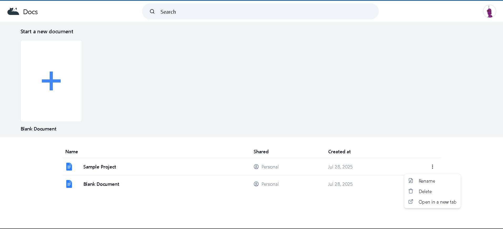
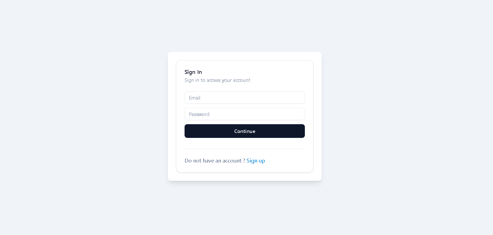
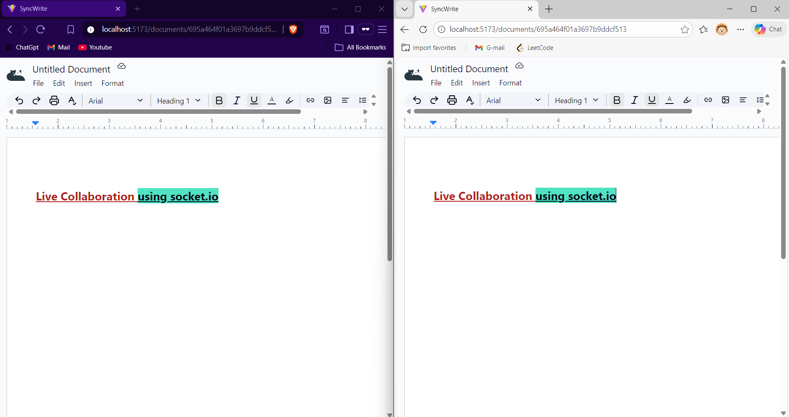

# ✨ SyncWrite – Real-Time Collaborative Text Editor

> A rich-text web editor enabling multiple users to collaborate in real time. Built with the MERN stack and powered by Socket.IO.

---

## 🚀 Features

- 🔒 **Authentication** using JWT and protected routes  
- 🖊️ **Rich-text editing** with Tiptap (tables, tasks, links, and more)  
- 🔄 **Real-time collaboration** via Socket.IO  
- ☁️ **Autosave** to MongoDB for persistent editing  
- 📂 **Create / delete documents**  
- 🎨 **Responsive UI** with Atomic Design + Tailwind CSS  
- 💡 **Modular architecture** using Controller-Service-Repository pattern  

---

## 🧱 Tech Stack

| Layer         | Tech Stack                           |
|---------------|--------------------------------------|
| Frontend      | React, Tiptap, Tailwind CSS          |
| Backend       | Node.js, Express.js                  |
| Realtime      | Socket.IO                            |
| Database      | MongoDB                              |
| Auth          | JSON Web Tokens (JWT)                |
| Design Pattern| Atomic Design,Layered architecture   |

---
## Screenshots

| Home Page                | Login Page                |
|--------------------------|---------------------------|
|  |  |

**Collaboration in Editor**



---

## 🛠️ Getting Started

```bash
git clone https://github.com/AnujPurohit800/SyncWrite.git
cd SyncWrite

📦 Setup Frontend

cd Frontend
npm install
npm run dev
cd ..

🔧 Setup Backend

cd Backend
npm install
npm start

## 📬 API Collection

You can test all backend endpoints using Postman:

👉 [Download Postman Collection](./Backend/syncWrite.postman_collection.json)

Import this into Postman and explore all available routes for document creation, collaboration, and authentication.
